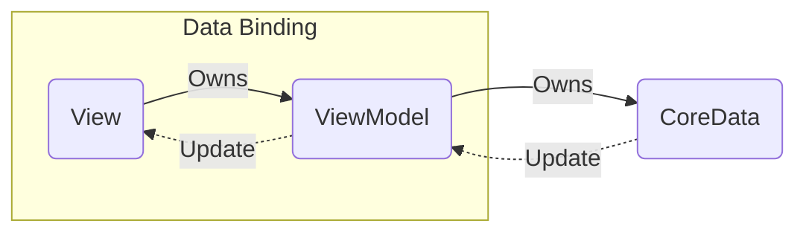

# メモアプリ
メモが記録アプリをMVVMで作りました。

一覧画面、追加、変更、削除の機能、ダークモード対応を実装しています。

本アプリは、[iPhoneアプリ開発集中オンライン講座「CodeCandy」](https://code-candy.com/p/ios)の講座内で出題されている課題です。

ソースコードを見る前に、[こちらのご確認](https://code-candy.com/courses/ios/lectures/33267857)をお願いします。

# フロー図



# 実行画面

https://user-images.githubusercontent.com/68992872/177164576-71d115fe-1f00-4832-9c60-e797d22db580.mov

# 機能・特徴・推しポイント
- シンプルなメモアプリ

- CoreDataを利用してアプリを終了してもデータは端末に残ります

- 不要なメモは左スワイプで簡単に削除可能

- メモ内容をタップすると編集可能

- ダークモードに対応

# 実行手順
 ## 1, プロジェクトを立ち上げる
 ```
git clone https://github.com/~~
cd/to/path
open MemoApp.xcodeproj
 ```
 ## 2, シミュレータor実機を起動
 シミュレータで任意のバージョンのiphoneを選択もしくは実機を選択し実行
 
 # 開発環境
- Xcode 13.4.1
- macOS Monterey 12.4
- iPhone simulater 13.4.1
- iPhone実機 iOS15.5
  SwiftUIで開発されているためiOS13以降が必要です
# 作成者
https://twitter.com/YMPa_FXSB103
# ライセンス
"MemoApp" is under [MIT license](https://en.wikipedia.org/wiki/MIT_License).
