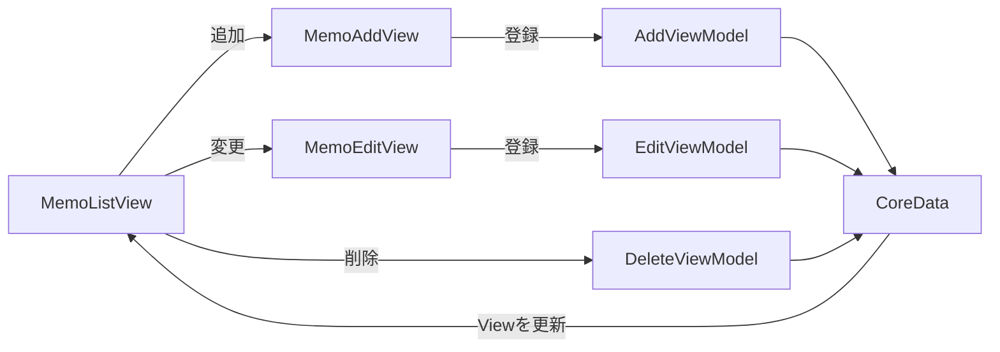

# メモアプリ
メモが記録アプリをMVVMで作りました。

一覧画面、追加、変更、削除の機能、ダークモード対応を実装しています。

本アプリは、[iPhoneアプリ開発集中オンライン講座「CodeCandy」](https://code-candy.com/p/ios)の講座内で出題されている課題です。

ソースコードを見る前に、[こちらのご確認](https://code-candy.com/courses/ios/lectures/33267857)をお願いします。

CoreDataを初めて利用したので忘備録的にコメントを残しています。ご了承ください。

# フロー図



# 実行画面

https://user-images.githubusercontent.com/68992872/177164576-71d115fe-1f00-4832-9c60-e797d22db580.mov

# 機能
- シンプルなメモアプリ
- メモは左スワイプで簡単に削除
- メモ内容をタップで編集
- ダークモードに対応

# 特徴
- CoreDataを利用してアプリを終了してもデータは端末に残ります
- SwiftLint導入
https://github.com/CodeCandySchool/MemoApp_ymp-a/blob/7f8c2bcfef5463453bae9eddcd4ef24a267c7e78/.swiftlint.yml#L1-L14
- extensionで背景色管理
https://github.com/CodeCandySchool/MemoApp_ymp-a/blob/ac8c089c599e11f5c19e83e24ce2e9385d9da85d/MemoApp/Model/ColorExtension.swift#L11-L28

# キーボード外をタップで簡単ポップダウン機能
@FocusStateで入力フィールド外のタップを検出してキーボードを収納します。

focusedFieldの値があるならキーボードをポップアップ、nilならキーボードをポップダウン。

●MemoAddView.swiftより抜粋
```swift
 // @FocusStateの定義にもある通り、ValueはHashableである必要がある為、準拠しています。
    enum Field: Hashable {
        case add
    }
 // @FocusStateを付与した値をnilにするとキーボードが閉じてくれるのでオプショナルにしています。
    @FocusState private var focusedField: Field?
    
    （省略）
    
 // 第一引数には@FocusStateの値を渡し、第二引数には今回はどのfocusedFieldを指しているのかを渡しています。
     .focused($focusedField, equals: .add)
     .onTapGesture {
         focusedField = .add
     }
     
     （省略）
     
 } // VSTACKここまで
     // 範囲内ならタップでできるようになっている
     .contentShape(RoundedRectangle(cornerRadius: 10))
     // タップした時の処理
     .onTapGesture {
         focusedField = nil
     } // onTapGesture
```
# 苦労したポイント
- EditViewへの行データ渡し

●MemoListsView.swiftより抜粋
```swift
struct MemoListsView: View {
          (省略)
 　　　　　　// タップした行の情報を渡す
    private var editMemo: Memo?
          (省略)
                        // 取得したデータをリスト表示
                        List {
                            ForEach(memos) { memo in
                                // 行毎に編集Viewとmemo情報を生成している
                                NavigationLink(destination: MemoEditView(editMemo: memo)) {
                                    HStack {
                                        // 一部のテキスト装飾は+で繋げればよい
                                        Text("\(memo.context!)")
                                            .fontWeight(.bold)
                                            .font(.title)
                                            + Text("\n\(memo.date!, formatter: memoFormatter)")
                                            .fontWeight(.bold)
                                        Spacer()
                                    } // HStackここまで
                                    //　checkedフラグを変更する
                                    .contentShape(Rectangle())
                                } // NavigationLinkここまで
                            } // ForEachここまで
```
●MemoEditView.swiftより抜粋
```swift
struct MemoEditView: View {
          (省略)
    // 行データを受信する
    private var editMemo: Memo?
          (省略)
    init(editMemo: Memo?) {
        // TextEditorの背景色を設定するため
        UITextView.appearance().backgroundColor = .clear
        // 1行のデータをnilチェック
        if let editMemo = editMemo {
            //　self.editMemoが21行目のeditMemoのこと、初期化後に代入している
            self.editMemo = editMemo
            // メモ内容をアンラップして代入
            self._context = State(initialValue: editMemo.context!)
            // 時間をアンラップして代入
            self._editDate = State(initialValue: editMemo.date!)

        } else {
            // プレビュー用
            self._context = State(initialValue: "testmemo")
            self._editDate = State(initialValue: Date())
        }
    } // initここまで          
```
- ViewModelへDelete機能分割
https://github.com/CodeCandySchool/MemoApp_ymp-a/blob/7f8c2bcfef5463453bae9eddcd4ef24a267c7e78/MemoApp/View/MemoListsView.swift#L66-L71
https://github.com/CodeCandySchool/MemoApp_ymp-a/blob/7f8c2bcfef5463453bae9eddcd4ef24a267c7e78/MemoApp/ViewModel/DeleteViewModel.swift#L11-L27
- 追加ボタンの書き方
https://github.com/CodeCandySchool/MemoApp_ymp-a/blob/7f8c2bcfef5463453bae9eddcd4ef24a267c7e78/MemoApp/View/MemoListsView.swift#L77-L99
# 実行手順
 ## 1, プロジェクトを立ち上げる
 ```
git clone https://github.com/~~
cd/to/path
open MemoApp.xcodeproj
 ```
 ## 2, シミュレータor実機を起動
 シミュレータで任意のバージョンのiphoneを選択もしくは実機を選択し実行
 
 # 開発環境
- Xcode 13.4.1
- macOS Monterey 12.4
- iPhone simulater 13.4.1
- iPhone実機 iOS15.5
  SwiftUIで開発されているためiOS13以降が必要です
# 作成者
https://twitter.com/YMPa_FXSB103
# ライセンス
"MemoApp" is under [MIT license](https://en.wikipedia.org/wiki/MIT_License).
